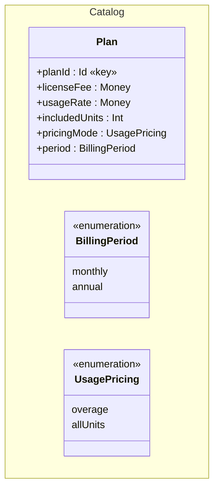

<!-- generated by lattice; do not edit -->

# Catalog — diagrams

*Product catalog: plan definitions consumed by Subscriptions.*

## Domain

```mermaid
classDiagram
  namespace Catalog {
    class Plan {
      +planId : Id «key»
      +licenseFee : Money
      +usageRate : Money
      +includedUnits : Int
      +pricingMode : UsagePricing
      +period : BillingPeriod
    }
    class BillingPeriod {
      <<enumeration>>
      monthly
      annual
    }
    class UsagePricing {
      <<enumeration>>
      overage
      allUnits
    }
  }
```
