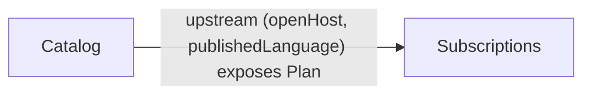

<!-- generated by lattice; do not edit -->

# AcmeBilling — context map

*Acme billing: catalog-driven subscriptions.*

## Relationships

- Catalog upstreamDownstream Subscriptions
  Subscriptions consumes plan definitions from the catalog.
