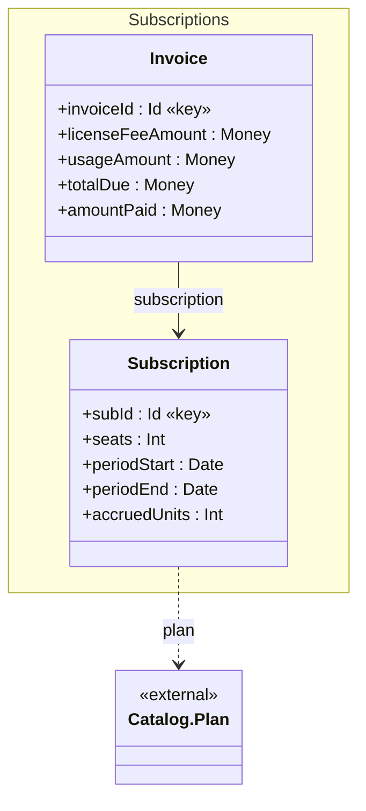
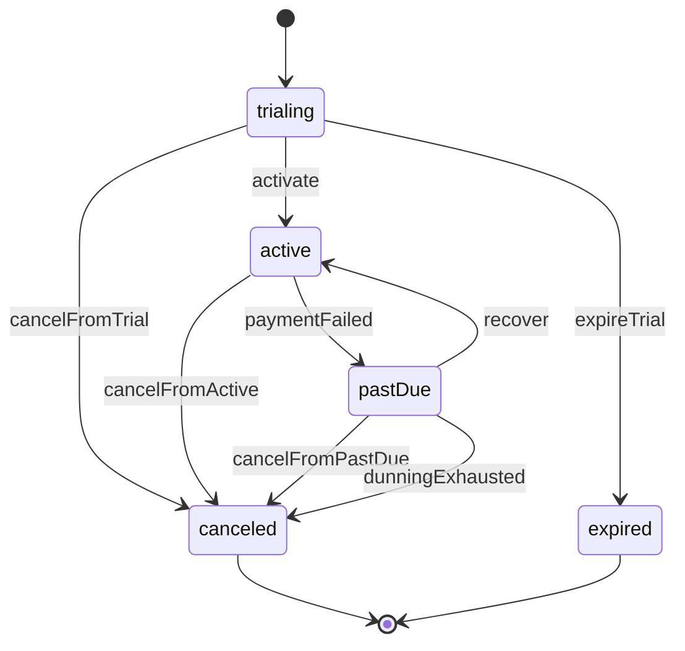
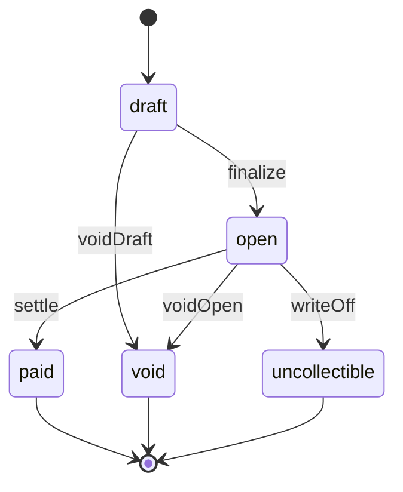

<!-- generated by lattice; do not edit -->

# Subscriptions — diagrams

*Subscriptions API: hybrid license-fee + usage-based billing*

## Domain

## Subscription — status

A customer's subscription to a Plan; usage accrues per billing period and resets at rollover

## Invoice — settlement

Period invoice: license-fee portion plus usage portion; partial payments accrue

